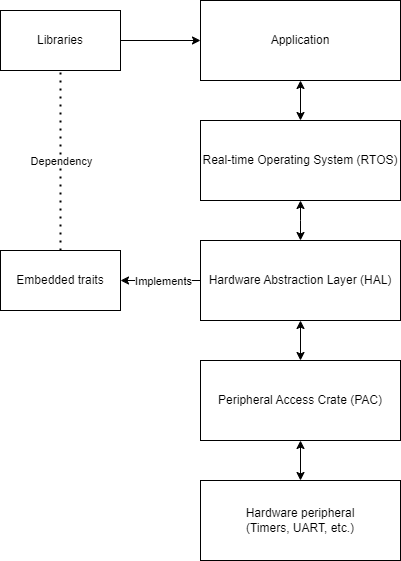
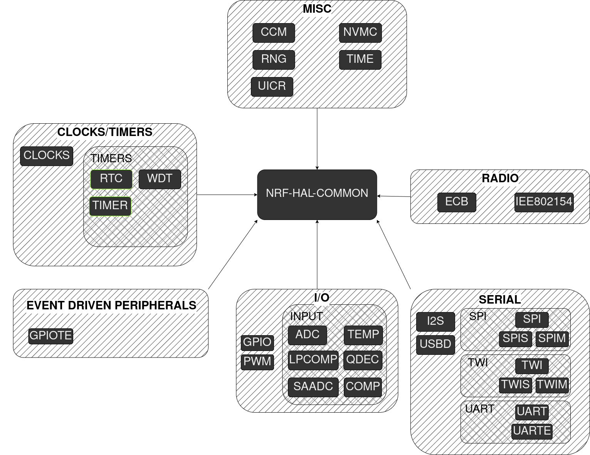

# **NRF-HAL**
Native implementation of rtic monotonic timers for the nrf-52840

---

# What is rtic

- Real-Time Interrupt driven Concurrency
- LTU
- ARM cortex-m

---

# What is a HAL




- Hardware Abstraction Layer
- Implements strategies

```rust
/// A serial interface
pub trait Serial {
    /// Error type associated to this serial interface
    type Error;

    /// Reads a single byte
    fn read(&mut self) -> nb::Result<u8, Self::Error>;

    /// Writes a single byte
    fn write(&mut self, byte: u8) -> nb::Result<(), Self::Error>;
}
```


---

# NRF-HAL



- Rust
- Type level
- Safe and predictable


---

# Timers and RTCs

- Applications
- Frequencies
- Aha!

--- 

# Attempt one

- Generic interface for both rtc and timer
- Compile time guarantee of correctness

```rust

pub struct MonotonicTimer<T: Instance<RegBlock = TimerRegBlock0>, const FREQ: u32> {
    instance:PhantomData<T>,
}

```

---

# Register access by trait system

```rust
/// A trait that ensures register access for the [`pac`](`crate::pac`)
/// abstractions
pub trait Instance {
    /// The type of the underlying register block
    type RegBlock;
    /// Returns a pointer to the underlying register block
    ///
    /// Allows modification of the registers at a type level rather than
    /// by storing the [`Instance`] at run-time.
    fn reg<'a>() -> &'a Self::RegBlock;
        const DISABLE_INTERRUPT_ON_EMPTY_QUEUE: bool = true;
}
pub trait RtcInstance: Instance<RegBlock = super::RtcRegBlock> {}
pub trait TimerInstance: Instance<RegBlock = super::TimerRegBlock0> {}
```

--- 

# Compiler bugs and headaches

- Mutually exclusive traits
```rust
impl<T:RtcInstance, const FREQ:u32> Monotonic for MonotonicTimer<T,FREQ>{...}
impl<T:TimerInstance, const FREQ:u32> Monotonic for MonotonicTimer<T,FREQ>{...}
```
- Aha! Bug in rustc

---

# Back to the drawing board

- Two distinct types
```rust
pub struct MonotonicTimer<T: Instance<RegBlock = TimerRegBlock0>, const FREQ: u32> {
    ...
}
pub struct MonotonicRtc<T: Instance<RegBlock = RtcRegBlock>, const FREQ: u32> {
    ...
}
```
- Yet more issues...

---

# Frequency gating construction

- Timer
9 different prescalers
- Rtc
$2^{12}-1$ prescalers

---

# Final interface

##### Timer
```rust
#[monotonic(binds = TIMER3, default = true)]
type MyMono = MonotonicTimer<TIMER3,16_000_000>;
/// new only exists on valid frequencies
let mono = MyMono::new(ctx.device.TIMER3);
```

---

# Final interface

##### Rtc
```rust
#[monotonic(binds = RTC0, default = true)]
type MyMono = MonotonicRtc<RTC0, 32_768>;
let clocks = hal::clocks::Clocks::new(cx.device.CLOCK);
let clocks = clocks.start_lfclk();
/// Will throw error if freq is invalid
let mono = MyMono::new(cx.device.RTC0,&clocks).unwrap();
```

---

# References and futher reading

- rtic https://rtic.rs/2/book/en/
- nrf-hal https://docs.rs/nrf52840-hal/latest/nrf52840_hal/
- embedded-hal https://docs.rs/embedded-hal/latest/embedded_hal/